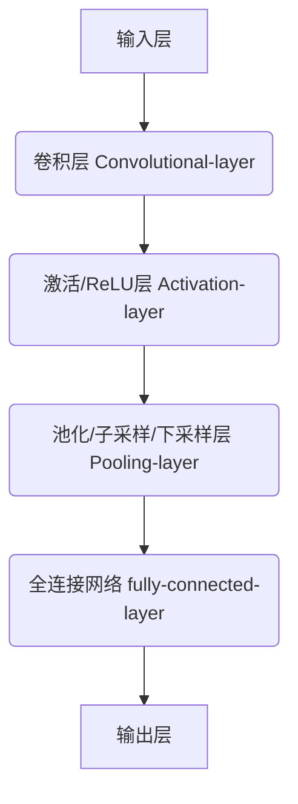

<!--
 * @?: *********************************************************************
 * @Author: Weidows
 * @LastEditors: Weidows
 * @LastEditTime: 2022-05-22 11:14:28
 * @FilePath: \Blog-private\source\_posts\python\AI\DL.md
 * @Description:
 * @!: *********************************************************************
-->



- 再啃-Deep-Learning
  - 深度学习
    - 一个好的表示学习策略必须具备一定的深度
    - 特征
      - 像是宰鱼要分多步,每步使用不同方式/工具
      - 通常从底层特征开始经过多步非线性转换才能得到好的高层语义表示
    - 特点
      - 增加特征重用性,指数级增加表示能力
    - [表示学习与深度学习关系](https://www.helloimg.com/images/2022/03/10/RCdJ0c.png)
    - 关键问题: 贡献度分配
      - 不同组件/参数对系统输出结果的影响权重
  - 神经网路
    - 人工神经网络
      - 由大量神经元及它们之间的有向连接构成
      - 三方面
        - 神经元/感知器
        - 网络的拓扑结构
          - LeNet
          - AlexNet
          - VGGNet
          - ResNet
        - 学习算法
      - [分类](https://www.helloimg.com/images/2022/03/19/Rat37q.png)
        - 单类网络
          - 前馈网络
          - 记忆网络
          - 图网络
        - 复合型网络
    - 贡献度分配问题
      - 不同 component 或 param 对最终系统输出结果的贡献
      - 利用偏导数求解贡献度
    - 发展史
      - 模型提出
      - 冰河期
      - 反向传播算法引起的复兴
      - 流行度降低
      - 深度学习崛起



> 由于 DL 是 ML 的子问题, 所以此篇着重写 [🥵 硬啃-Machine-Learning](../ML) 里面涉及甚少的 (解耦) \
> 有一些 (比如损失函数, 梯度下降) 隶属于 ML > DL ,所以堆在了 ML 里面

## 代码

> 本篇所用到的代码在这: [👀Code-4-Machine-Learning](../../../public-post/notebook/DL)

## 序

- 简单解释 DL 到底在做什么?

  传统 ML 就像是在教小学生如何通过一系列`固定公式`搞出来一个结果,在公式不太复杂/运算量不太大时, 教起来还好

  那怎么教一个小学生高数题呢? 也是可以让他死记硬背公式的,但是效果并不好

  DL 就像是在教他转换思想 (函数,导数,积分...), 遇到题目后,具体套什么公式, 由小学生自己找到

DL 不像 ML 一样泛泛, 对每种任务有针对性的设计

---



  <!-- tab 优点 -->

    就像上面提到的, 传统 ML 需要人教给机器特征工程 (固定公式), 模型越复杂, 人的提取方法和特征结果会越差

    DL 对特征的处理方法/结果要优于人类 (比如深层次人类无法察觉的特征关系)

  <!-- endtab -->

  <!-- tab 缺点 -->

    DL 模型的能力是 (人类传授的基本功 + 题海战术) 得来的;

    1. 刷题少时反不如套公式
    2. 基本功构建成本高
    3. 可解释性差 (虽然基本功是你教的,但你不知道机器是用的什么歪门邪道的心法)

  <!-- endtab -->



## 神经网路

大多知名的模型都是属于 `深度神经网络` 的, 比如 CNN, RNN, GAN ...

### 神经元-感知器

- 感知器就是一个神经元, 神经网络的组成单元, 可自学习为回归/分类器

  

  $$
  y = f(w1 \cdot x1 + w2 \cdot x2 + b)
  $$

  当调整 $w,b$ 时,可以得到不同的变体逻辑运算(比如与或非);

  给定训练数据集, $w,b$ 可以通过学习自动调整

  ***

- 学习规则核心思想: `错误驱动`

  1. 权值初始化
  2. 输入样本对
  3. 计算输出
  4. 根据感知器学习规则调整权值
  5. 返回到步骤 2. 输入下一对样本,周而复始直到对所有样本,感知器的实际输出与期望输出相等

  ***

- 

    
 例题 

  ***

  

  1. 初始化向量

  $$
  W(0) = (0.5,1,-1,0)^T \rArr W^T(0) = (0.5,1,-1,0)
  $$

  2. 输入样本
  3. 计算输出

  $$
  W^T(0)X^1 = (0.5,1,-1,0) \cdot (-1,1,-2,0)^T = 2.5
  $$

  4. 调整权值,这里使用上面[#激活函数](#激活函数)的阶跃函数例子

  权向量第一个分量也就是 0.5 为阈值

  $$
  \begin{aligned}
    o^1(0) &= sgn(W^T(0)X^1) \\
    &= sgn(2.5) = 1

      \\ \ \\

      W(1) &=W(0) + \eta \left[d^{1}-o^{1}(0)\right] X^{1} \\
    &= (0.5,1,-1,0)^{T} + 0.1 (- 1- 1)(-1,1,-2,0)^{T} \\
    &= \left(\mathbf{0.7,0.8,-0.6,0)^{T}}\right.

      \\ \ \\

      W(2) &=W(1) + \eta \left[d^{2}-o^{2}(1)\right] X^{2} \\
    &= (0.7,0.8,-0.6,0)^{T} + 0.1 [- 1-(- 1)](-1,0,1.5,-0.5)^{T} \\
    &= \left(\mathbf{0.7,0.8,-0.6,0)^{T}}\right.

      \\ \ \\

      W(3) &=W(2) + \eta \left[d^{3}-o^{3}(2)\right] X^{3} \\
    &= (0.7,0.8,-0.6,0)^{T} + 0.1 [1-(- 1)](-1,-1,1,0.5)^{T} \\
    &= \left(\mathbf{0.5,0.6,-0.4,0.1)^{T}}\right.
  \end{aligned}
  $$

  5. 返回 2. 直到

  $$
  d^{P} - o^{P} = 0 \qquad (p = 1,2,3)
  $$

  

### 前馈神经网络

把若干个感知器叠几层, 形成单向类网状结构, 称为多层前馈神经网络 (Multi-layer Feedforward Neural Networks), `前馈` 是指前一层输出作为后一层输入

- 每个箭头直线代表一个 "向量":

  $$
  w ^{k}  _{a \ b}
  $$

  k: 权重

  a: 前一层第 a 个神经元

  b: 后一层第 b 个神经元

  ***

- 同一层感知器之间不相连, 与前后两层全相连, 为`全连接神经网络` (fully-connected neural network)

  这种网络有硬性缺点:

  1. 丢失数据的空间信息 (比如 3d 图像会展开为向量)
  2. 参数量太多,难训
  3. 层级浅, 大量参数易过拟合

  后面 CNN 对此缺点做了优化

### 反向传播

- 反向传播/误差反向传播 (Backpropagation algorithm), 根据输出层输出值来反向调整隐藏层权重的一种方法

  - 我们常用 `梯度下降方法` 来更新权重, 梯度下降应用于有明确求导/可求出误差的情况

  - 但是对于含有多个隐藏层的神经网络, 隐藏层求不出误差, 只有输出层有

  - 反向传播就是一个把输出层误差反向传播到隐藏层的过程

- 图解 [\[2\]](#cite_note-2)

  

  

  实现原理就是求偏导

  

### 卷积神经网络-CNN

卷积神经网络(Convolutional Neural Network，CNN), 视觉领域难以撼动的老大

#### what

对于一个 .mp3 的音乐 (频域记录, .wav 是时域记录), 某一时间点的音波可以`假定认为`是多个函数交杂而成的

$$
y = h_{耳机音效} \left[ f_{人声}(t) * g_{乐器}(t) \right] * i_{响度}(t)
$$

某一时间点的音波,就是这一堆函数的`卷积`, 简单来说就是在某个维度上 `加权 + 叠加`

---

#### 结构

1. 卷积层: 就像是多个科目 (卷积核) 的老师给出试卷, 让"输入"做答
2. 激活层: 不同科目老师判卷,得出有没有及格,及格的话计多少分
3. 池化层: 成绩取最大值或者平均值, 减少计算量
4. 全连接层: 年级排名
5. 输出层: 是否获奖(二分类) / 排名前百分之几十(多分类)

---

#### 卷积层

可以直观看出, 其作用为 `降维` 和 `提取特征`

---

#### 激活层

> 将输入信号的总和转换为输出信号的函数被称为激活函数

- 如下为一种简单实现: 阶跃函数:

  

  其阈值是可以改变的:

  $$
  sgn(x) =
  \begin{cases}
    1 & if \ x > 0 \\
    0 & if \ x = 0 \\
    -1 & if \ x < 0
  \end{cases}
  $$

- 还有很多其他的激活函数, 用途各异, 详见[\[1\]](#cite_note-1)

  sigmoid 函数

  tanh 双曲正切函数

  ReLU (Rectified Linear Units, 修正线性单元, CNN 常用)

  ...

---

#### 池化层

一方面, 缩小分辨率降低运算量, 一方面扩大神经元的`感受野` (特征捕获范围)

也就使得层次越深, 单位神经元在有损条件下捕获特征/语义信息的范围越大

## MMDetection

参考课程 [\[3\]](#cite_note-3)

### 图像分类



- 图像分类模型
  - LeNet-5 (1998)
  - AlexNet (2012)
  - VGGNet (2014)
  - GoogleNet (2014)
  - ResNet (2015)



---

### 目标检测

等大窗口 -> 滑动窗口 -> 多尺度滑窗 -> 图像金字塔

#### 区域提议

但上面设计需要做的分类数太多,难以满足实时性, 可以先用 `区域提议 Region Proposal` 提取出可能包含物体的区域

#### 非极大值抑制

## 借物表

<a name='cite_note-1' href='#cite_ref-1'>[1]</a>: [42 个激活函数的全面总结](https://mp.weixin.qq.com/s/Um8wAtdxPcVN8ACiVtSgFg)

<a name='cite_note-2' href='#cite_ref-2'>[2]</a>: [【深度学习】基础 叁：反向传播算法](https://discover304.top/2021/11/30/2021q4/107-1-dl-back/)

<a name='cite_note-3' href='#cite_ref-3'>[3]</a>: [4 小时入门深度学习+实操 MMDetection 第一课](https://www.bilibili.com/video/BV1ou411k7fD)
