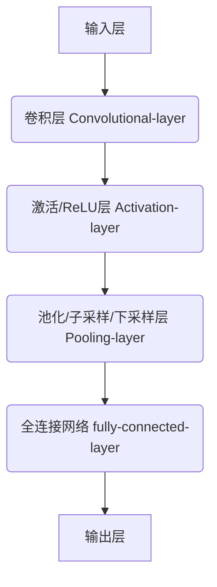

<!--
 * @?: *********************************************************************
 * @Author: Weidows
 * @LastEditors: Weidows
 * @LastEditTime: 2022-06-24 02:25:57
 * @FilePath: \Blog-private\source\_posts\python\AI\DL.md
 * @Description:
 * @!: *********************************************************************
-->



- 再啃-Deep-Learning
  - 深度学习
    - 一个好的表示学习策略必须具备一定的深度
    - 特征
      - 像是宰鱼要分多步,每步使用不同方式/工具
      - 通常从底层特征开始经过多步非线性转换才能得到好的高层语义表示
    - 特点
      - 增加特征重用性,指数级增加表示能力
    - [表示学习与深度学习关系](https://www.helloimg.com/images/2022/03/10/RCdJ0c.png)
    - 关键问题: 贡献度分配
      - 不同组件/参数对系统输出结果的影响权重
  - 神经网路
    - 人工神经网络
      - 由大量神经元及它们之间的有向连接构成
      - 三方面
        - 神经元/感知器
        - 网络的拓扑结构
          - LeNet
          - AlexNet
          - VGGNet
          - ResNet
        - 学习算法
      - [分类](https://www.helloimg.com/images/2022/03/19/Rat37q.png)
        - 单类网络
          - 前馈网络
          - 记忆网络
          - 图网络
        - 复合型网络
    - 贡献度分配问题
      - 不同 component 或 param 对最终系统输出结果的贡献
      - 利用偏导数求解贡献度
    - 发展史
      - 模型提出
      - 冰河期
      - 反向传播算法引起的复兴
      - 流行度降低
      - 深度学习崛起
  - MMDetection
    - 图像分类
      - 模型发展
        - LeNet-5 (1998)
        - AlexNet (2012)
        - VGGNet (2014)
        - GoogleNet (2014)
        - ResNet (2015)
    - 模型训练
      - 配置文件
        - 模型结构
          - 模型有几层
          - 每层多少通道数
        - 数据集
          - 数据集划分
            - 常用的有 COCO 格式, `annotation/test.json -> test/images`
          - 数据文件路径
          - 数据增强策略
        - 训练策略
          - 梯度下降算法
          - 学习率参数
          - batch_size
          - 训练总轮次
          - 学习率变化策略
        - runtime / 运行时
          - GPU
          - 分布式环境配置
        - 一些辅助功能
          - 打印日志
          - checkpoint / 定时保存
  - MMDetection3D



> 由于 DL 是 ML 的子问题, 所以此篇着重写 [🥵 硬啃-Machine-Learning](../ML) 里面涉及甚少的 (解耦) \
> 有一些 (比如损失函数, 梯度下降) 隶属于 ML > DL ,所以堆在了 ML 里面

> - 本篇所用到的代码在这: \
>   [👩‍❤️‍💋‍👨Code-4-Deep-Learning](../../code/DL) \
>   [🐳MM-Detection-Colab](../../code/MM-Detection)

<a></a>

## ML-2-DL

- 简单解释 DL 到底在做什么?

  传统 ML 就像是在教小学生如何通过一系列`固定公式`搞出来一个结果,在公式不太复杂/运算量不太大时, 教起来还好

  那怎么教一个小学生高数题呢? 也是可以让他死记硬背公式的,但是效果并不好

  DL 就像是在教他转换思想 (函数,导数,积分...), 遇到题目后,具体套什么公式, 由小学生自己找到

DL 不像 ML 一样泛泛, 对每种任务有针对性的设计

---



  <!-- tab 优点 -->

    就像上面提到的, 传统 ML 需要人教给机器特征工程 (固定公式), 模型越复杂, 人的提取方法和特征结果会越差

    DL 对特征的处理方法/结果要优于人类 (比如深层次人类无法察觉的特征关系)

  <!-- endtab -->

  <!-- tab 缺点 -->

    DL 模型的能力是 (人类传授的基本功 + 题海战术) 得来的;

    1. 刷题少时反不如套公式
    2. 基本功构建成本高
    3. 可解释性差 (虽然基本功是你教的,但你不知道机器是用的什么歪门邪道的心法)

  <!-- endtab -->



<a></a>

## 神经网路

大多知名的模型都是属于 `深度神经网络` 的, 比如 CNN, RNN, GAN ...

### 神经元-感知器

- 感知器就是一个神经元, 神经网络的组成单元, 可自学习为回归/分类器

  

  $$
  y = f(w1 \cdot x1 + w2 \cdot x2 + b)
  $$

  当调整 $w,b$ 时,可以得到不同的变体逻辑运算(比如与或非);

  给定训练数据集, $w,b$ 可以通过学习自动调整

  ***

- 学习规则核心思想: `错误驱动`

  1. 权值初始化
  2. 输入样本对
  3. 计算输出
  4. 根据感知器学习规则调整权值
  5. 返回到步骤 2. 输入下一对样本,周而复始直到对所有样本,感知器的实际输出与期望输出相等

  ***

- <details>

    <summary> 例题 </summary>

  ***

  

  1. 初始化向量

  $$
  W(0) = (0.5,1,-1,0)^T \rArr W^T(0) = (0.5,1,-1,0)
  $$

  2. 输入样本
  3. 计算输出

  $$
  W^T(0)X^1 = (0.5,1,-1,0) \cdot (-1,1,-2,0)^T = 2.5
  $$

  4. 调整权值,这里使用上面[#激活函数](#激活函数)的阶跃函数例子

  权向量第一个分量也就是 0.5 为阈值

  $$
  \begin{aligned}
    o^1(0) &= sgn(W^T(0)X^1) \\
    &= sgn(2.5) = 1

      \\ \ \\

      W(1) &=W(0) + \eta \left[d^{1}-o^{1}(0)\right] X^{1} \\
    &= (0.5,1,-1,0)^{T} + 0.1 (- 1- 1)(-1,1,-2,0)^{T} \\
    &= \left(\mathbf{0.7,0.8,-0.6,0)^{T}}\right.

      \\ \ \\

      W(2) &=W(1) + \eta \left[d^{2}-o^{2}(1)\right] X^{2} \\
    &= (0.7,0.8,-0.6,0)^{T} + 0.1 [- 1-(- 1)](-1,0,1.5,-0.5)^{T} \\
    &= \left(\mathbf{0.7,0.8,-0.6,0)^{T}}\right.

      \\ \ \\

      W(3) &=W(2) + \eta \left[d^{3}-o^{3}(2)\right] X^{3} \\
    &= (0.7,0.8,-0.6,0)^{T} + 0.1 [1-(- 1)](-1,-1,1,0.5)^{T} \\
    &= \left(\mathbf{0.5,0.6,-0.4,0.1)^{T}}\right.
  \end{aligned}
  $$

  5. 返回 2. 直到

  $$
  d^{P} - o^{P} = 0 \qquad (p = 1,2,3)
  $$

  </details>

<a></a>

### 前馈神经网络

把若干个感知器叠几层, 形成单向类网状结构, 称为多层前馈神经网络 (Multi-layer Feedforward Neural Networks), `前馈` 是指前一层输出作为后一层输入


- 每个箭头直线代表一个 "向量":

  $$
  w ^{k}  _{a \ b}
  $$

  k: 权重

  a: 前一层第 a 个神经元

  b: 后一层第 b 个神经元

  ***

- 同一层感知器之间不相连, 与前后两层全相连, 为`全连接神经网络` (fully-connected neural network)

  这种网络有硬性缺点:

  1. 丢失数据的空间信息 (比如 3d 图像会展开为向量)
  2. 参数量太多,难训
  3. 层级浅, 大量参数易过拟合

  后面 CNN 对此缺点做了优化

<a></a>

### 反向传播

- 反向传播/误差反向传播 (Backpropagation algorithm), 根据输出层输出值来反向调整隐藏层权重的一种方法

  - 我们常用 `梯度下降方法` 来更新权重, 梯度下降应用于有明确求导/可求出误差的情况

  - 但是对于含有多个隐藏层的神经网络, 隐藏层求不出误差, 只有输出层有

  - 反向传播就是一个把输出层误差反向传播到隐藏层的过程

- 图解 <sup id='cite_ref-2'>[\[2\]](#cite_note-2)</sup>

  

  

  实现原理就是求偏导

  

<a></a>

### 卷积神经网络-CNN

卷积神经网络(Convolutional Neural Network, CNN), 视觉领域难以撼动的老大

#### what

对于一个 .mp3 的音乐 (频域记录, .wav 是时域记录), 某一时间点的音波可以`假定认为`是多个函数交杂而成的

$$
y = h_{耳机音效} \left[ f_{人声}(t) * g_{乐器}(t) \right] * i_{响度}(t)
$$

某一时间点的音波,就是这一堆函数的`卷积`, 简单来说就是在某个维度上 `加权 + 叠加`

---

#### 结构




1. 卷积层: 就像是多个科目 (卷积核) 的老师给出试卷, 让"输入"做答
2. 激活层: 不同科目老师判卷,得出有没有及格,及格的话计多少分
3. 池化层: 成绩取最大值或者平均值, 减少计算量
4. 全连接层: 年级排名
5. 输出层: 是否获奖(二分类) / 排名前百分之几十(多分类)

---

#### 卷积层


可以直观看出, 其作用为 `降维` 和 `提取特征`

---

#### 激活层

> 将输入信号的总和转换为输出信号的函数被称为激活函数

- 如下为一种简单实现: 阶跃函数:

  

  其阈值是可以改变的:

  $$
  sgn(x) =
  \begin{cases}
    1 & if \ x > 0 \\
    0 & if \ x = 0 \\
    -1 & if \ x < 0
  \end{cases}
  $$

- 还有很多其他的激活函数, 用途各异, 详见<sup id='cite_ref-1'>[\[1\]](#cite_note-1)</sup>

  sigmoid 函数

  tanh 双曲正切函数

  ReLU (Rectified Linear Units, 修正线性单元, CNN 常用)

  ...

---

#### 池化层


一方面, 缩小分辨率降低运算量, 一方面扩大神经元的`感受野` (特征捕获范围)

也就使得层次越深, 单位神经元在有损条件下捕获特征/语义信息的范围越大

<a></a>

## MMDetection

> 参考课程 <sup id='cite_ref-3'>[\[3\]](#cite_note-3)</sup> \
> 

### 图像分类


---

### 目标检测

#### 第一阶段-问题与方案

##### 图像分割

等大窗口 -> 滑动窗口 -> 多尺度滑窗 -> 图像金字塔


##### 区域提议

但上面设计需要做的分类数太多,难以满足实时性, 可以先用 `区域提议 Region Proposal` 提取出可能包含物体的区域


##### 非极大值抑制


---

#### 第二阶段-优化算法

##### 共享特征与-RoI-Pooling

对于每个提议框 -> CNN 前传, 有大量重叠提议框(重复的卷积运算), 所以改进为: `全图单次 CNN 前传 -> 全图特征图 -> 根据提议框裁剪预测`


##### RPN-区域提议网络

Region Proposal Network


##### FPN-特征金字塔网络


---

#### Faster-RCNN

`Faster - Region proposal - CNN` 一个很经典的例子, 应用上面的优化算法网络 <sup id='cite_ref-5'>[\[5\]](#cite_note-5)</sup>

>  \
>  \
> 

---

#### 目标检测划分

可以通过下面三种形式划分 <sup id='cite_ref-6'>[\[6\]](#cite_note-6)</sup>



- 目标检测划分
  - stage
    - one-stage (单阶段)
      - RetinaNet
      - YOLO
      - FCOS
      - RepPoints
    - two-stage (双阶段)
      - FasterRCNN
      - CascadeRCNN
      - LibraRCNN
      - TridentNet
  - anchor (锚框)
    - anchor-based
      - FasterRCNN
      - YOLO
    - anchor-free
      - FCOS
  - transformer
    - DETR
    - Deformable DETR





<!-- tab 单阶段 -->


单阶段最常用的就是 YOLO (You Only Look Once), 每代都会有设计更新和优化,如下为 v3 设计


<!-- endtab -->

<!-- tab 双阶段 -->

上面介绍的都是双阶段算法,与单阶段区别主要在于`是否有区域提议阶段`, 单阶段算法只通过不同尺寸的锚框(检测头)进行物体预测


具体来看,与上面网络结合:


<!-- endtab -->

<!-- tab 无锚框算法 -->

另一类分支, 有锚框的话会有大量超参使模型复杂度上升, 无锚框的话性能又会下降

<!-- endtab -->



<a></a>

### 模型构建流程

现阶段 AI 领域把很多算法模块化了, 提出的新算法大多也是对某一功能模块的改进, 构建一个大型模型可以像是装高达一样挑选合适的算法/网络模块进行组合.

mmdet 就是蛮复杂的, 抽象成了多个功能模块 <sup id='cite_ref-6'>[\[6\]](#cite_note-6)</sup>, 每个功能模块又有多个实现算法.




<!-- tab backbone -->

backbone (主干网络) 经常会在预训练模型选取时看到, 作用为`特征提取`, 常见的比如 50 层 ResNet -> R-50

<!-- endtab -->

<!-- tab neck -->

neck 是对 backbone 提取的特征进行融合/增强, 然后传给 head. 常见的 neck 为 FPN (特征金字塔网络)

<!-- endtab -->

<!-- tab enhance -->

> enhance 是即插即用、能够对特征进行增强的模块

<!-- endtab -->

<!-- tab head -->

Head 检测头模块是对模型性能影响最显著的地方, 有框坐标回归和目标分类两个分支

<!-- endtab -->

<!-- tab BBox -->

Bonding Box 是检测头模块的一个分支, 它的作用是对检测结果进行回归, 得到框坐标\
功能模块有 BBox 分配 (进行正负样本定义或者正负样本分配),采样,编解码,后处理, 以及对应的 loss

<!-- endtab -->

<!-- tab tricks -->

tricks 就是训练/测试的技巧/配置, 大部分的调参工作就是在调整这部分, 比如 batch, Lr, 数据增强等..

<!-- endtab -->



<a></a>

### 模型训练

MMDetection 基本结构: `依赖 + [模型] + 数据集 + 配置文件 -> Trainable`

#### dataset-COCO

数据集分很多格式, 常见的比如 COCO:

```python
dataset_type = 'CocoDataset'
data_root = 'data/coco/'
data = dict(
  samples_per_gpu=2,
  workers_per_gpu=2,
  train=dict(
    type=dataset_type,
    ann_file=data_root + 'annotations/instances_train2017.json',
    img_prefix=data_root + 'train2017/',
    pipeline=train_pipeline),
  val=dict(
    type=dataset_type,
    ann_file=data_root + 'annotations/instances_val2017.json',
    img_prefix=data_root + 'val2017/',
    pipeline=test_pipeline),
  test=dict(
    type=dataset_type,
    ann_file=data_root + 'annotations/instances_val2017.json',
    img_prefix=data_root + 'val2017/',
    pipeline=test_pipeline)
)
```

#### pipeline


#### Lr-Scheduler

Learning Rate Scheduler 学习率策略, 常见模型中标注的 `1x 2x`


<a></a>

### 性能衡量

> 目标检测中衡量识别精度的指标是 mAP（mean average precision）。多个类别物体检测中，每一个类别都可以根据 recall(查全率) 和 precision(查准率) 绘制一条曲线(P-R 曲线)，AP 就是该曲线下的面积，mAP 是多个类别 AP 的平均值 <sup id='cite_ref-8'>[\[8\]](#cite_note-8)</sup> \
> 

<a></a>

## MMDetection3D

入门一个技术, 需要大致概览一下, 正巧 MM-Lab 应时发布了教程 <sup id='cite_ref-4'>[\[4\]](#cite_note-4)</sup>

MMDetection3D 依赖于 MMDetection 和 MMSegmentation, 适用于检测和分割 3D 场景下的物体


### 坐标系

- 深度坐标系 Depth 主要被用于通过深度相机采集的数据集, 大多是室内场景点云检测.

- 激光雷达坐标系 LiDAR, 适用于室外场景点云检测

- 相机坐标系 Camera, 该坐标系在室内室外场景的点云检测均有使用, 代表彩色相机的常用坐标系, 一般用于数据格式的转换. 在多模态或者单目 3D 的检测器中, 相机坐标系是三维点云与二维图像之间的桥梁. <sup id='cite_ref-7'>[\[7\]](#cite_note-7)</sup>

三种坐标系构造不同, 但基准点都是物体底部中心点, 不同坐标系可以转换

<a></a>

## 借物表

<a name='cite_note-1' href='#cite_ref-1'>[1]</a>: [42 个激活函数的全面总结](https://mp.weixin.qq.com/s/Um8wAtdxPcVN8ACiVtSgFg)

<a name='cite_note-2' href='#cite_ref-2'>[2]</a>: [【深度学习】基础 叁：反向传播算法](https://discover304.top/2021/11/30/2021q4/107-1-dl-back/)

<a name='cite_note-3' href='#cite_ref-3'>[3]</a>: [4 小时入门深度学习+实操 MMDetection 第一课](https://www.bilibili.com/video/BV1ou411k7fD)

<a name='cite_note-4' href='#cite_ref-4'>[4]</a>: [带你玩转 3D 检测和分割 一：MMDetection3D 整体框架介绍](https://zhuanlan.zhihu.com/p/478307528)

<a name='cite_note-5' href='#cite_ref-5'>[5]</a>: [一文读懂 Faster RCNN](https://zhuanlan.zhihu.com/p/31426458)

<a name='cite_note-6' href='#cite_ref-6'>[6]</a>: [轻松掌握 MMDetection 整体构建流程(一)](https://zhuanlan.zhihu.com/p/337375549)

<a name='cite_note-7' href='#cite_ref-7'>[7]</a>: [带你玩转 3D 检测和分割 （二）：核心组件分析之坐标系和 Box](https://zhuanlan.zhihu.com/p/491614921)

<a name='cite_note-8' href='#cite_ref-8'>[8]</a>: [目标检测中的 mAP 是什么含义？](https://www.zhihu.com/question/53405779)
