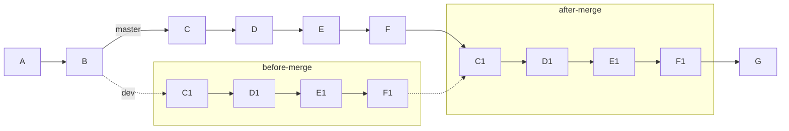
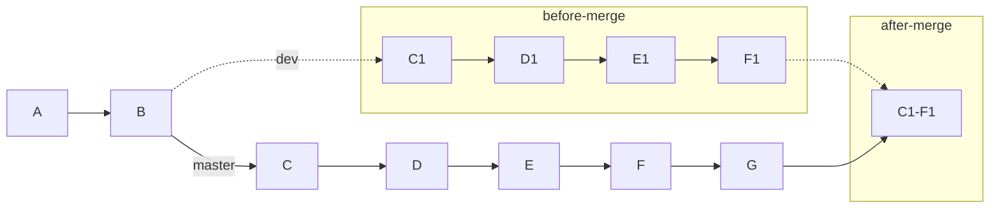

<!--
 * @Author: Weidows
 * @Date: 2020-11-21 19:28:51
 * @LastEditors: Weidows
 * @LastEditTime: 2022-02-15 17:17:08
 * @FilePath: \Blog-private\source\_posts\tools\Git\matters.mmd.md
 * @Description:
-->

1. [实用操作](#实用操作)
   1. [三种-merge](#三种-merge)
      1. [common-merge](#common-merge)
      2. [squash-merge](#squash-merge)
      3. [rebase-merge](#rebase-merge)
   2. [配置代理](#配置代理)
   3. [版本回退](#版本回退)
   4. [创建独立分支](#创建独立分支)
   5. [缩小仓库体积](#缩小仓库体积)
      1. [删除提交记录](#删除提交记录)
      2. [分支独立法](#分支独立法)
2. [GitHub](#github)
   1. [首页绿格子](#首页绿格子)
   2. [License 选择](#license-选择)
   3. [pages-域名](#pages-域名)
   4. [删除远程分支](#删除远程分支)
   5. [github-action](#github-action)
      1. [checkout](#checkout)
      2. [国内时区错位问题](#国内时区错位问题)
3. [凭证和权限](#凭证和权限)
   1. [问题一](#问题一)
   2. [问题二](#问题二)
   3. [问题三](#问题三)
   4. [问题四](#问题四)
4. [参考](#参考)

<a></a>

## 实用操作

### 三种-merge


- 设当前 git-status:

  ```mermaid
  graph LR
    A --> B

    B --master--> C --> D --> E --> F --> G
    B -.dev.-> C1


    subgraph merge-target
      C1 --> D1 --> E1 --> F1
    end
  ```

---

#### common-merge

默认的 merge,保留所有 commit 信息,merge 操作生成一个 merge-commit



#### squash-merge

压缩合并,将几次提交的信息合并; 需手动提交所以会改变 commit-user<sup id='cite_ref-01'>[\[1\]](#cite_note-01)</sup>

适用场景为: 同一开发者负责合与被合两 branch, 并且被合并的 branch 记录并不重要



#### rebase-merge

rebase 变基不会像 squash 那样变更 commit-user 信息,而且 commit 的合并是手动选择性的

比如下面合并 commit D1 和 E1,然后 branch-merge

- 总图

  ```mermaid
  graph LR
    A --> B --master--> C --> D --> E --> F
    F -.dev.-> C1'

    B -.dev.-> C1
    subgraph before-merge
      C1 --> D1 --> E1 --> F1
    end

    F1 .-> C1'

    subgraph rebase
      C1'[C1] --> D1-E1 --> F1'[F1]
    end

    F --master--> C1''
    F1' .-> C1''

    subgraph after-merge
      C1''[C1] --> D1-E1'[D1-E1] --> F1''[F1]
    end

    F1'' --> G
  ```

  ***

- 分三步图

  ```mermaid
  graph LR
    A --> B

    B --master--> C --> D --> E --> F
    B -.dev.-> C1

    subgraph before-merge
      C1 --> D1 --> E1 --> F1
    end

    F --> G
  ```

  ```mermaid
  graph LR
    A --> B --master--> C --> D --> E --> F
    F -.dev.-> C1'

    B -.dev.-> C1
    subgraph before-merge
      C1 --> D1 --> E1 --> F1
    end

    F1 .-> C1'

    subgraph rebase
      C1'[C1] --> D1-E1 --> F1'[F1]
    end

    F --master--> G
  ```

  ```mermaid
  graph LR
    A --> B --master--> C --> D --> E --> F
    F --> C1'

    B -.dev.-> C1
    subgraph before-merge
      C1 --> D1 --> E1 --> F1
    end

    subgraph after-merge
      C1' --> D1-E1 --> F1'
    end
    F1' --> G
  ```

---

### 配置代理

- 有时候 github 会被墙,导致无法推送,需要挂代理

- 方案:

  ```shell
  git config --global https.proxy http://127.0.0.1:1080
  ```

- 或者直接修改`~/.gitconfig`文件

  ```
  [core]
    autocrlf = true
    longpaths = true
    editor = code.exe
  [user]
    name = Weidows
    email = utsuko27@qq.com
  [http]
    proxy = localhost://127.0.0.1:7890
  [https]
    proxy = localhost://127.0.0.1:7890
  ```

---

### 版本回退

不小心把 ssh 私钥 copy 到了 git 库里提到了 github 上,差点 GG

> [Git 恢复之前版本的两种方法 reset、revert（图文详解）](https://blog.csdn.net/yxlshk/article/details/79944535)

1. reset 到出错提交的前一个提交
2. 修改,提交
3. 强制提交(不强制的话不行): git push origin master -f

---

### 创建独立分支

> git checkout --orphan 新分支名

---

### 缩小仓库体积

#### 删除提交记录

有的仓库因为有时候会提交图片,导致仓库体积格外的庞大

而且大到一定程度会被平台检查 (所以要想办法缩小)

---

- 我要压缩的是 [Keeper](https://github.com/Weidows-projects/Keeper) 项目

  因为每天都要提交一张必应壁纸,所以一年下来体积到了 400+ MB

  我想把壁纸拿走,并且把 git 中提交记录也删掉以抹除体积

  ***

- 开始我想的是把现有文件复制到一个新建的库,再把这个库 force push 到 github

  出乎意料,旧的提交并没有消失; 可以看到强推 `重构` 前面有一个断档,那之前的就是旧提交

  

  ***

- 为什么出现这情况? 我给画了个图

  

  所以,原因是没删除 github 上的 tags,删掉就没了捏

---

#### 分支独立法

- 起初使用的是上面的方法,后来突然想到把这些大文件独立分支

  当需要减小体积时,本地保留好当前内容然后直接删除分支

  再重新拉起一个同名分支 force push

- 这个方法应该更好些,避免删除不必要内容.

<a></a>

## GitHub

### 首页绿格子

- Github 不显示 fork 仓库的 commit, 需要独立出来

---

### License 选择


一般盲怼 `MIT` 就好,不过上图没给出

> 感觉菜鸟教程的文章最详细: [各种开源协议介绍](https://www.runoob.com/w3cnote/open-source-license.html)

---

### pages-域名

- GitHub 与 Gitee-pages 部署域名规则不同.

- github 上当且仅当 Repo 名字为`userName.github.io`时,域名为`userName.github.io`
  - 其他 Repo 名字为`userName.github.io/repoName/`
- Gitee 是当且仅当 Repo 名字为`userName.gitee.io`时,域名为`userName.gitee.io`
  - 否则类似上面

---

### 删除远程分支

- 不能删除当前默认分支.

---

### github-action

#### checkout


- checkout 默认下只会检出默认分支,不会 clone submodules,可以设置自定义

  ```
  - name: Clone repository
    uses: actions/checkout@v2
    with:
      ref: dev # checkout dev branch
      submodules: true
  ```

---

#### 国内时区错位问题

- 我在东八区,布置的 GitHub Action 是 0 点执行
  - 结果是在早上八点多才执行的(大概是八点半左右,误差<5min)
  - 因为 GitHub 服务器不是在国内,时区不同,其对应的大概是欧洲伦敦那块的标准时区.
- `结论`:布置 Action 定时任务时,设置的时间要早八个小时(对应东八区)

<a></a>

## 凭证和权限

### 问题一

- 本地 git 有时候会遇到 github 凭证失效问题

- 在 VScode 里的 git 仓库失效后会老是催你登陆,没完没了

  - (VScode 让你登录后只是暂时性的,你关闭后就还是会失效)

  ***

- 解决办法: VScode 让登录时一次,然后保存凭证就好了!

  ```
  git config --global credential.helper store
  ```

---

### 问题二

- 推送时报:"无权限推送到 xxx 仓库"

  问题原因是`本地的认证失效了`,但是 Git 并不会自动清除让你重新认证

- 我遇到这个问题是在 Git 某次更新后, `credential.helper store` 情况下.

  解决办法: 删掉 `~/.git-credentials` 这个文件,它失效了,重新认证一下就好

---

### 问题三

- push 本地仓库到 github 时遇到:

  > refusing to allow an OAuth App to create or update workflow `.github/workflo

  这是由于仓库中更改了 workflow(github-action) 的内容,而且本地 git 仓库是用 OAuth 方式认证的

  ***

- 解决办法的话,网上其他文章是一水的改凭据 (我不想这么干)

  两种办法,配置 ssh-key 或者可以试着安装 `github-cli` ,然后用 PTA (personal access token) 认证登录 (如果已经登录过就再次刷新登录)

  ```
  gh auth login

  是否用github-cli来认证github网站 -> 是
  HTTPS/SSh -> 选HTTPS
  填入PTA登录成功
  ```

  ***

- 成功后可以看到 ~/.gitconfig 多了几行

  ```
  [credential "https://github.com"]
    helper = !D:\\Game\\Scoop\\apps\\Github-CLI\\current\\bin\\gh.exe auth git-credential
  ```

  现在再次推送应该没问题了.

---

### 问题四

```
> git pull --tags origin master
From https://github.com/Weidows-projects/Programming-Configuration
 * branch            master     -> FETCH_HEAD
hint: You have divergent branches and need to specify how to reconcile them.
hint: You can do so by running one of the following commands sometime before
hint: your next pull:
hint:
hint:   git config pull.rebase false  # merge (the default strategy)
hint:   git config pull.rebase true   # rebase
hint:   git config pull.ff only       # fast-forward only
hint:
hint: You can replace "git config" with "git config --global" to set a default
hint: preference for all repositories. You can also pass --rebase, --no-rebase,
hint: or --ff-only on the command line to override the configured default per
hint: invocation.
fatal: Need to specify how to reconcile divergent branches.
```

- 解决:

  ```
  git config pull.ff false
  git config --global pull.rebase false
  ```

  > https://www.fenovice.com/

  `更好的办法是换一个Git版本`

<a></a>

## 参考

<a name='cite_note-01' href='#cite_ref-01'>[1]</a>: [git merge 的三种操作 merge, squash merge, 和 rebase merge](https://www.jianshu.com/p/ff1877c5864e)
